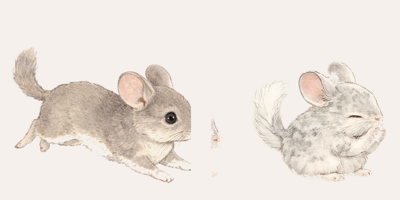

# Pet Desktop Widget

A cute floating desktop widget that shows illustrations of your pets hanging out in a corner of your screen. They idle, run around, eat, groom, do happy jumps ("popcorning"), and sleep — all on their own, right on top of whatever you're working on.

Built for macOS with Electron. Works with any pet — you just provide your own illustrations.

## What it does

Your two pets live in a small transparent window in the corner of your screen. Throughout the day, they'll:

- **Idle** — sit still with a gentle bobbing motion
- **Run** — scamper across the widget window
- **Eat** — nibble on food with a little head bob
- **Groom** — clean themselves with their paws
- **Popcorn** — do happy little jumps (if you know, you know)
- **Sleep** — curl up and breathe gently

Everything happens automatically on natural-feeling timers. You can drag the widget anywhere on your screen and resize it.

## What you need

1. **Node.js** — download and install from [nodejs.org](https://nodejs.org) (choose the "LTS" version). This is a one-time setup.
2. **12 pet sprite images** — illustrations of your pets in each pose (see below for how to generate these for free)

## Step 1: Get the code

Download or clone this folder to your computer.

## Step 2: Generate your pet sprites

You need 12 images: 6 poses for each of your 2 pets. The easiest way is to use ChatGPT (free) to generate them.

1. Open [PROMPTS.md](PROMPTS.md) — it has ready-to-use prompts for each pose
2. Replace the placeholder descriptions with your pets' actual appearance (fur color, markings, etc.)
3. Paste each prompt into ChatGPT one at a time
4. Download each image as a PNG
5. Save them in the `sprites/` folder with these exact filenames:

```
sprites/pet1-idle.png
sprites/pet1-running.png
sprites/pet1-eating.png
sprites/pet1-grooming.png
sprites/pet1-popcorning.png
sprites/pet1-sleeping.png
sprites/pet2-idle.png
sprites/pet2-running.png
sprites/pet2-eating.png
sprites/pet2-grooming.png
sprites/pet2-popcorning.png
sprites/pet2-sleeping.png
```

## Step 3: Install and run

Open **Terminal** (search for "Terminal" in Spotlight with Cmd+Space), then type these commands:

```bash
# Go to the widget folder (drag the folder into Terminal to paste the path)
cd /path/to/pet-desktop-widget

# Install dependencies (only needed once)
npm install

# Run the widget
npm start
```

Your pets should appear in the top-right corner of your screen!

## Using the widget

- **Drag** — click and drag anywhere in the widget to move it
- **Resize** — drag the edges or corners to make it bigger or smaller
- **Menu bar icon** — click the small circle in your Mac's menu bar to show/hide the widget
- **Right-click the menu bar icon** — options to reset position or quit

## Customizing

### Change pet sizes

In `renderer.js`, find these lines near the top:

```javascript
const PET_2_SCALE = 0.9;  // Pet 2 is 90% the size of Pet 1
```

Change `0.9` to `1.0` to make both pets the same size, or `0.8` to make Pet 2 smaller.

### Change how often behaviors happen

In `renderer.js`, find the `BEHAVIOR` section. Times are in milliseconds (1000 = 1 second, 60000 = 1 minute):

```javascript
running:    { interval: 600000, ... }   // runs every ~10 minutes
eating:     { interval: 600000, ... }   // eats every ~10 minutes
grooming:   { interval: 480000, ... }   // grooms every ~8 minutes
popcorning: { interval: 900000, ... }   // popcorns every ~15 minutes
```

Lower the numbers to make behaviors happen more often.

### Change the widget window size

In `main.js`, find:

```javascript
const winW = 400;
const winH = 300;
```

### Change the background transparency

In `index.html`, find:

```css
background: rgba(245, 240, 233, 0.30);
```

The last number (`0.30`) is the opacity. Use `0` for fully transparent, `1` for solid.

## Packaging as an app (optional)

To create a standalone `.app` you can double-click (no Terminal needed):

```bash
npm run pack
```

This creates a `Pet Widget-darwin-arm64` folder with the app inside. Drag it to your Applications folder.

Note: The default pack command is set up for Apple Silicon (M1/M2/M3) Macs. If you have an Intel Mac, change `arm64` to `x64` in the `pack` script in `package.json`.

## Preview page

Open `preview.html` in your browser to test your sprites and see all the behaviors without launching the full widget. Click the buttons to trigger each behavior manually, or use "Auto" mode.

## Troubleshooting

**"npm: command not found"**
You need to install Node.js first. Download it from [nodejs.org](https://nodejs.org).

**Sprites not showing up**
Make sure your image files are in the `sprites/` folder with the exact filenames listed above (lowercase, with dashes).

**Widget is invisible**
Right-click the menu bar icon and choose "Reset Position" to bring it back to the default corner.

**White backgrounds on sprites**
When generating images, make sure to ask for "transparent background". If needed, use a free tool like [remove.bg](https://remove.bg) to remove white backgrounds from your PNGs.

## How it works (for the curious)

The widget is built with [Electron](https://www.electronjs.org/), which is a tool that turns web pages into desktop apps. The code is split into:

- `main.js` — creates the floating window and menu bar icon
- `renderer.js` — the "brain" that decides what each pet does and when
- `index.html` — the visual layout (just two image containers)
- `sprites/` — your pet illustrations (one image per pose)

The behavior engine uses a simple state machine: each pet is always in one state (idle, running, eating, etc.) and switches based on timers with some randomness so it feels natural, not robotic.

## License

MIT — do whatever you want with it. Made with love for pets everywhere.

Here's mine — Biscuit and Minty!


